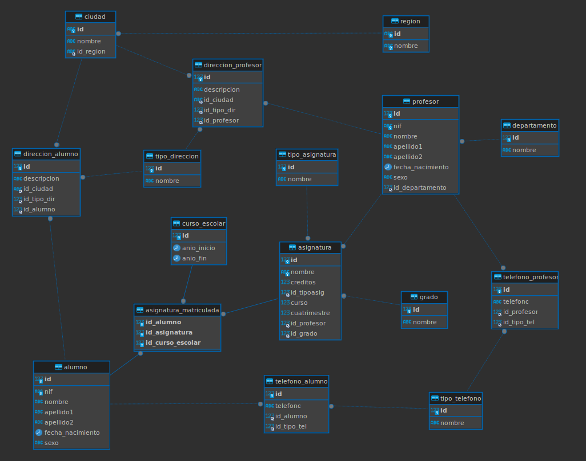

```sql
CREATE DATABASE IF NOT EXISTS universidad;
USE universidad;

CREATE TABLE departamento (
	id INT AUTO_INCREMENT PRIMARY KEY,
	nombre VARCHAR (100) NOT NULL
);

CREATE TABLE grado (
	id INT AUTO_INCREMENT PRIMARY KEY,
	nombre VARCHAR (50) NOT NULL
);

CREATE TABLE curso_escolar (
	id INT AUTO_INCREMENT PRIMARY KEY,
	anio_inicio YEAR (4) NOT NULL,
	anio_fin YEAR (4) NOT NULL
);

CREATE TABLE tipo_asignatura (
	id TINYINT AUTO_INCREMENT PRIMARY KEY,
	nombre VARCHAR(70) NOT NULL
);

CREATE TABLE alumno (
	id INT AUTO_INCREMENT PRIMARY KEY,
	nif VARCHAR(9) UNIQUE NOT NULL,
	nombre VARCHAR (25) NOT NULL,
	apellido1 VARCHAR (25) NOT NULL,
	apellido2 VARCHAR (25) NOT NULL,
	fecha_nacimiento DATE NOT NULL,
	sexo ENUM ('H','M')
);

CREATE TABLE tipo_direccion (
	id TINYINT AUTO_INCREMENT PRIMARY KEY,
	nombre VARCHAR(70) NOT NULL
);

CREATE TABLE tipo_telefono (
	id TINYINT AUTO_INCREMENT PRIMARY KEY,
	nombre VARCHAR(70) NOT NULL
);

CREATE TABLE region (
	id VARCHAR(2) PRIMARY KEY,
	nombre VARCHAR(70) NOT NULL UNIQUE
); 

CREATE TABLE ciudad (
	id VARCHAR(5) PRIMARY KEY,
	nombre VARCHAR(70) NOT NULL,
    id_region VARCHAR (2) NOT NULL,
    CONSTRAINT fk_ciudad_region FOREIGN KEY (id_region) REFERENCES region (id)
);

CREATE TABLE direccion_alumno (
	id INT AUTO_INCREMENT PRIMARY KEY,
	descripcion VARCHAR (250) NOT NULL,
	id_ciudad VARCHAR(5) NOT NULL,
	id_tipo_dir TINYINT NOT NULL,
	id_alumno INT NOT NULL,
	CONSTRAINT fk_dir_alumno FOREIGN KEY (id_alumno) REFERENCES alumno (id),
	CONSTRAINT fk_diralum_ciu FOREIGN KEY (id_ciudad) REFERENCES ciudad (id),
	CONSTRAINT fk_diralum_tipo FOREIGN KEY (id_tipo_dir) REFERENCES tipo_direccion (id)
);

CREATE TABLE telefono_alumno (
	id INT AUTO_INCREMENT PRIMARY KEY,
	telefono VARCHAR (10) NOT NULL,
	id_alumno INT NOT NULL,
	id_tipo_tel TINYINT NOT NULL,
	CONSTRAINT fk_tel_alumno FOREIGN KEY (id_alumno) REFERENCES alumno (id),
	CONSTRAINT fk_telAlum_tipo FOREIGN KEY (id_tipo_tel) REFERENCES tipo_telefono (id)
);

CREATE TABLE profesor (
	id INT AUTO_INCREMENT PRIMARY KEY,
    nif VARCHAR (9) UNIQUE NOT NULL,
    nombre VARCHAR(25) NOT NULL,
    apellido1 VARCHAR (25) NOT NULL,
    apellido2 VARCHAR (25) NOT NULL,
    fecha_nacimiento DATE NOT NULL,
    sexo ENUM ('H','M'),
    id_departamento INT,
    CONSTRAINT fk_prof_dep FOREIGN KEY (id_departamento) REFERENCES departamento (id)
);

CREATE TABLE telefono_profesor(
	id INT AUTO_INCREMENT PRIMARY KEY,
    telefono VARCHAR (10) NOT NULL,
	id_profesor INT NOT NULL,
	id_tipo_tel TINYINT NOT NULL,
	CONSTRAINT fk_tel_profesor FOREIGN KEY (id_profesor) REFERENCES profesor (id),
	CONSTRAINT fk_telProf_tipo FOREIGN KEY (id_tipo_tel) REFERENCES tipo_telefono (id)
);

CREATE TABLE direccion_profesor (
	id INT AUTO_INCREMENT PRIMARY KEY,
	descripcion VARCHAR (250) NOT NULL,
	id_ciudad VARCHAR(5) NOT NULL,
	id_tipo_dir TINYINT NOT NULL,
	id_profesor INT NOT NULL,
	CONSTRAINT fk_dir_prof FOREIGN KEY (id_profesor) REFERENCES profesor (id),
	CONSTRAINT fk_dirprof_ciu FOREIGN KEY (id_ciudad) REFERENCES ciudad (id),
	CONSTRAINT fk_dirpro_tipo FOREIGN KEY (id_tipo_dir) REFERENCES tipo_direccion (id)
);

CREATE TABLE asignatura (
	id INT AUTO_INCREMENT PRIMARY KEY,
    nombre VARCHAR (100) UNIQUE NOT NULL,
    creditos FLOAT,
    id_tipoasig TINYINT NOT NULL,
    curso TINYINT NOT NULL,
    cuatrimestre TINYINT NOT NULL,
    id_profesor INT,
    id_grado INT,
    CONSTRAINT fk_tipoasig_asig FOREIGN KEY (id_tipoasig) REFERENCES tipo_asignatura (id),
    CONSTRAINT fk_asig_prof FOREIGN KEY (id_profesor) REFERENCES profesor (id),
    CONSTRAINT fk_asig_grado FOREIGN KEY (id_grado) REFERENCES grado (id)
);

CREATE TABLE asignatura_matriculada(
	id_alumno INT NOT NULL,
    id_asignatura INT NOT NULL,
    id_curso_escolar INT NOT NULL,
    PRIMARY KEY (id_alumno, id_asignatura, id_curso_escolar),
    CONSTRAINT fk_alum_matri FOREIGN KEY (id_alumno) REFERENCES alumno (id),
    CONSTRAINT fk_asig_matri FOREIGN KEY (id_asignatura) REFERENCES asignatura (id),
    CONSTRAINT fk_curso_matri FOREIGN KEY (id_curso_escolar) REFERENCES curso_escolar (id)
);


-- Registros para la tabla departamento
INSERT INTO departamento VALUES (NULL,'Informática');
INSERT INTO departamento VALUES (NULL,'Matemáticas');
INSERT INTO departamento VALUES (NULL,'Economía y Empresa');
INSERT INTO departamento VALUES (NULL,'Educación');
INSERT INTO departamento VALUES (NULL,'Agronomía');
INSERT INTO departamento VALUES (NULL,'Química y Física');
INSERT INTO departamento VALUES (NULL,'Filología');
INSERT INTO departamento VALUES (NULL,'Derecho');
INSERT INTO departamento VALUES (NULL,'Biología y Geología');

-- Registros para la tabla grado
INSERT INTO grado VALUES (NULL,'Grado en Ingeniería Agrícola (Plan 2015)');
INSERT INTO grado VALUES (NULL,'Grado en Ingeniería Eléctrica (Plan 2014)');
INSERT INTO grado VALUES (NULL,'Grado en Ingeniería Electrónica Industrial (Plan 2010)');
INSERT INTO grado VALUES (NULL,'Grado en Ingeniería Informática (Plan 2015)');
INSERT INTO grado VALUES (NULL,'Grado en Ingeniería Mecánica (Plan 2010)');
INSERT INTO grado VALUES (NULL,'Grado en Ingeniería Química Industrial (Plan 2010)');
INSERT INTO grado VALUES (NULL,'Grado en Biotecnología (Plan 2015)');
INSERT INTO grado VALUES (NULL,'Grado en Ciencias Ambientales (Plan 2009)');
INSERT INTO grado VALUES (NULL,'Grado en Matemáticas (Plan 2010)');
INSERT INTO grado VALUES (NULL,'Grado en Química (Plan 2009)');

-- Registros para la tabla curso_escolar
INSERT INTO curso_escolar VALUES (NULL,2014, 2015);
INSERT INTO curso_escolar VALUES (NULL,2015, 2016);
INSERT INTO curso_escolar VALUES (NULL,2016, 2017);
INSERT INTO curso_escolar VALUES (NULL,2017, 2018);

-- Registros para la tabla tipo_asignatura
INSERT INTO tipo_asignatura (nombre) VALUES
('Básica'),
('Obligatoria'),
('Optativa');

-- Registros para la tabla alumno
INSERT INTO alumno VALUES (NULL,'89542419S', 'Juan', 'Saez', 'Vega','1992/08/08', 'H');
INSERT INTO alumno VALUES (NULL,'26902806M', 'Salvador', 'Sánchez', 'Pérez','1991/03/28', 'H');
INSERT INTO alumno VALUES (NULL,'17105885A', 'Pedro', 'Heller', 'Pagac','2000/10/05', 'H');
INSERT INTO alumno VALUES (NULL,'04233869Y', 'José', 'Koss', 'Bayer','1998/01/28', 'H');
INSERT INTO alumno VALUES (NULL,'97258166K', 'Ismael', 'Strosin', 'Turcotte','1999/05/24', 'H');
INSERT INTO alumno VALUES (NULL,'82842571K', 'Ramón', 'Herzog', 'Tremblay','1996/11/21', 'H');
INSERT INTO alumno VALUES (NULL,'46900725E', 'Daniel', 'Herman', 'Pacocha','1997/04/26', 'H');
INSERT INTO alumno VALUES (NULL,'11578526G', 'Inma', 'Lakin', 'Yundt','1998/09/01', 'M');
INSERT INTO alumno VALUES (NULL,'79089577Y', 'Juan', 'Gutiérrez', 'López','1998/01/01', 'H');
INSERT INTO alumno VALUES (NULL,'41491230N', 'Antonio', 'Domínguez', 'Guerrero','1999/02/11', 'H');
INSERT INTO alumno VALUES (NULL,'64753215G', 'Irene', 'Hernández', 'Martínez','1996/03/12', 'M');
INSERT INTO alumno VALUES (NULL,'85135690V', 'Sonia', 'Gea', 'Ruiz','1995/04/13', 'M');

-- Registros para la tabla tipo_direccion
INSERT INTO tipo_direccion (nombre) VALUES
('Casa'),
('Trabajo'),
('Otro');

-- Registros para la tabla tipo_telefono
INSERT INTO tipo_telefono (nombre) VALUES
('Móvil'),
('Fijo');

-- Registros para la tabla region
INSERT INTO region (id, nombre) VALUES
('01', 'Region de Murcia'),
('02', 'Principado Asturias'),
('03', 'Cataluña');

-- Registros para la tabla ciudad
INSERT INTO ciudad (id, nombre, id_region) VALUES
('001', 'Murcia', '01'),
('002', 'Asturias','02'),
('003', 'Cataluña', '03');

-- Registros para la tabla direccion_alumno
INSERT INTO direccion_alumno (descripcion, id_ciudad, id_tipo_dir, id_alumno) VALUES
('Calle Principal 123', '001', 1, 1),
('Avenida Central 456', '002', 2, 2),
('Plaza Mayor 789', '003', 3, 3),
('Calle Secundaria 321', '001', 1, 4);

-- Registros para la tabla telefono_alumno
INSERT INTO telefono_alumno (telefono, id_alumno, id_tipo_tel) VALUES
('123456789', 1, 1),
('987654321', 2, 2),
('555444333', 3, 1),
('999888777', 4, 2);

-- Registros para la tabla profesor
INSERT INTO profesor VALUES (NULL,'11105554G', 'Zoe', 'Ramirez', 'Gea','1979/08/19', 'M', 1);
INSERT INTO profesor VALUES (NULL,'38223286T', 'David', 'Schmidt', 'Fisher','1978/01/19', 'H', 2);
INSERT INTO profesor VALUES (NULL,'79503962T', 'Cristina', 'Lemke', 'Rutherford','1977/08/21', 'M', 3);
INSERT INTO profesor VALUES (NULL,'61142000L', 'Esther', 'Spencer', 'Lakin','1977/05/19', 'M', 4);
INSERT INTO profesor VALUES (NULL,'85366986W', 'Carmen', 'Streich', 'Hirthe','1971-04-29', 'M', 4);
INSERT INTO profesor VALUES (NULL,'73571384L', 'Alfredo', 'Stiedemann', 'Morissette', '1980/02/01', 'H', 6);
INSERT INTO profesor VALUES (NULL,'82937751G', 'Manolo', 'Hamill', 'Kozey','1977/01/02', 'H', 1);
INSERT INTO profesor VALUES (NULL,'80502866Z', 'Alejandro', 'Kohler', 'Schoen','1980/03/14', 'H', 2);
INSERT INTO profesor VALUES (NULL,'10485008K', 'Antonio', 'Fahey', 'Considine','1982/03/18', 'H', 3);
INSERT INTO profesor VALUES (NULL,'85869555K', 'Guillermo', 'Ruecker', 'Upton','1973/05/05', 'H', 4);
INSERT INTO profesor VALUES (NULL,'04326833G', 'Micaela', 'Monahan', 'Murray','1976/02/25', 'H', 5);
INSERT INTO profesor VALUES (NULL,'79221403L', 'Francesca', 'Schowalter', 'Muller', '1980/10/31', 'H', 6);

-- Registros para la tabla telefono_profesor
INSERT INTO telefono_profesor (telefono, id_profesor, id_tipo_tel) VALUES
('111222333', 1, 1),
('444555666', 2, 2),
('777888999', 3, 1),
('000999888', 4, 2),
('111222444', 7, 1), -- Teléfono móvil para el profesor con ID 7 (Manolo Hamill)
('888777999', 8, 2), -- Teléfono fijo para el profesor con ID 8 (Alejandro Kohler)
('666555333', 9, 1), -- Teléfono móvil para el profesor con ID 9 (Antonio Fahey)
('000111222', 10, 2), -- Teléfono fijo para el profesor con ID 10 (Guillermo Ruecker)
('444333222', 11, 1), -- Teléfono móvil para el profesor con ID 11 (Micaela Monahan)
('222111444', 12, 2); -- Teléfono fijo para el profesor con ID 12 (Francesca Schowalter)

-- Registros para la tabla direccion_profesor
INSERT INTO direccion_profesor (descripcion, id_ciudad, id_tipo_dir, id_profesor) VALUES
('Calle Principal 123', '001', 1, 1),
('Avenida Central 456', '002', 2, 2),
('Plaza Mayor 789', '003', 3, 3),
('Calle Secundaria 321', '001', 1, 4),
('Calle de la Luna 123', '001', 1, 7), -- Dirección de casa para el profesor con ID 7 (Manolo Hamill) en la ciudad de Murcia
('Avenida del Sol 456', '002', 2, 8), -- Dirección de trabajo para el profesor con ID 8 (Alejandro Kohler) en la ciudad de Asturias
('Paseo de las Estrellas 789', '003', 3, 9), -- Otra dirección para el profesor con ID 9 (Antonio Fahey) en la ciudad de Cataluña
('Calle de las Flores 123', '001', 1, 10), -- Dirección de casa para el profesor con ID 10 (Guillermo Ruecker) en la ciudad de Murcia
('Avenida del Mar 456', '002', 2, 11), -- Dirección de trabajo para el profesor con ID 11 (Micaela Monahan) en la ciudad de Asturias
('Paseo de los Sueños 789', '003', 3, 12);

-- Registros para la tabla asignatura

INSERT INTO asignatura (nombre, creditos, id_tipoasig, curso, cuatrimestre, id_profesor, id_grado) VALUES ('Álgegra lineal y matemática discreta', 6, 1, 1, 1, NULL, 4),
 ('Cálculo', 6, 1, 1, 1, NULL, 4),
 ('Física para informática', 6, 1, 1, 1, NULL, 4),
 ('Introducción a la programación', 6, 1, 1, 1, NULL, 4),
 ('Organización y gestión de empresas', 6, 1, 1, 1, NULL, 4),
 ('Estadística', 6, 1, 1, 2, NULL, 4),
 ('Estructura y tecnología de computadores', 6, 1, 1, 2, NULL, 4),
 ('Fundamentos de electrónica', 6, 1, 1, 2, NULL, 4),
 ('Lógica y algorítmica', 6, 1, 1, 2, NULL, 4),
 ('Metodología de la programación', 6, 1, 1, 2, NULL, 4);

-- Registros para la tabla asignatura_matriculada
INSERT INTO asignatura_matriculada VALUES (1, 1, 1);
INSERT INTO asignatura_matriculada VALUES (1, 2, 1);
INSERT INTO asignatura_matriculada VALUES (1, 3, 1);
INSERT INTO asignatura_matriculada VALUES (1, 4, 1);
INSERT INTO asignatura_matriculada VALUES (1, 5, 1);
INSERT INTO asignatura_matriculada VALUES (1, 6, 1);
INSERT INTO asignatura_matriculada VALUES (1, 7, 1);
INSERT INTO asignatura_matriculada VALUES (1, 8, 1);
INSERT INTO asignatura_matriculada VALUES (1, 9, 1);
INSERT INTO asignatura_matriculada VALUES (1, 10, 1);
INSERT INTO asignatura_matriculada VALUES (1, 1, 2);
INSERT INTO asignatura_matriculada VALUES (1, 2, 2);
INSERT INTO asignatura_matriculada VALUES (1, 3, 2);
INSERT INTO asignatura_matriculada VALUES (1, 1, 3);
INSERT INTO asignatura_matriculada VALUES (1, 2, 3);
INSERT INTO asignatura_matriculada VALUES (1, 3, 3);
INSERT INTO asignatura_matriculada VALUES (1, 1, 4);
INSERT INTO asignatura_matriculada VALUES (1, 2, 4);
INSERT INTO asignatura_matriculada VALUES (1, 3, 4);
INSERT INTO asignatura_matriculada VALUES (2, 1, 1);
INSERT INTO asignatura_matriculada VALUES (2, 2, 1);
INSERT INTO asignatura_matriculada VALUES (2, 3, 1);
INSERT INTO asignatura_matriculada VALUES (4, 1, 1);
INSERT INTO asignatura_matriculada VALUES (4, 2, 1);
INSERT INTO asignatura_matriculada VALUES (4, 3, 1);
INSERT INTO asignatura_matriculada VALUES (4, 1, 2);
INSERT INTO asignatura_matriculada VALUES (4, 2, 2);
INSERT INTO asignatura_matriculada VALUES (4, 3, 2);
INSERT INTO asignatura_matriculada VALUES (4, 4, 2);
INSERT INTO asignatura_matriculada VALUES (4, 5, 2);
INSERT INTO asignatura_matriculada VALUES (4, 6, 2);
INSERT INTO asignatura_matriculada VALUES (4, 7, 2);
INSERT INTO asignatura_matriculada VALUES (4, 8, 2);
INSERT INTO asignatura_matriculada VALUES (4, 9, 2);
INSERT INTO asignatura_matriculada VALUES (4, 10, 2);


```


**Consultas sobre una tabla**

1. Devuelve un listado con el primer apellido, segundo apellido y el nombre de
    todos los alumnos. El listado deberá estar ordenado alfabéticamente de
    menor a mayor por el primer apellido, segundo apellido y nombre.

  ```sql
  SELECT apellido1, apellido2, nombre
  FROM alumno
  ORDER BY apellido1, apellido2, nombre;
  
  +------------+-----------+----------+
  | apellido1  | apellido2 | nombre   |
  +------------+-----------+----------+
  | Domínguez  | Guerrero  | Antonio  |
  | Gea        | Ruiz      | Sonia    |
  | Gutiérrez  | López     | Juan     |
  | Heller     | Pagac     | Pedro    |
  | Herman     | Pacocha   | Daniel   |
  | Hernández  | Martínez  | Irene    |
  | Herzog     | Tremblay  | Ramón    |
  | Koss       | Bayer     | José     |
  | Lakin      | Yundt     | Inma     |
  | Saez       | Vega      | Juan     |
  | Sánchez    | Pérez     | Salvador |
  | Strosin    | Turcotte  | Ismael   |
  +------------+-----------+----------+
  
  ```


2. Averigua el nombre y los dos apellidos de los alumnos que no han dado de
    alta su número de teléfono en la base de datos.

  ```sql
  SELECT nombre, apellido1, apellido2
  FROM alumno
  LEFT JOIN telefono_alumno on alumno.id = telefono_alumno.id_alumno
  WHERE telefono_alumno.id IS NULL;
  
  +---------+------------+-----------+
  | nombre  | apellido1  | apellido2 |
  +---------+------------+-----------+
  | Ismael  | Strosin    | Turcotte  |
  | Ramón   | Herzog     | Tremblay  |
  | Daniel  | Herman     | Pacocha   |
  | Inma    | Lakin      | Yundt     |
  | Juan    | Gutiérrez  | López     |
  | Antonio | Domínguez  | Guerrero  |
  | Irene   | Hernández  | Martínez  |
  | Sonia   | Gea        | Ruiz      |
  +---------+------------+-----------+
  
  ```


3. Devuelve el listado de los alumnos que nacieron en 1999.

   ```sql
   SELECT nombre, apellido1, apellido2
   FROM alumno
   WHERE YEAR(fecha_nacimiento) = 1999;
   
   +---------+------------+-----------+
   | nombre  | apellido1  | apellido2 |
   +---------+------------+-----------+
   | Ismael  | Strosin    | Turcotte  |
   | Antonio | Domínguez  | Guerrero  |
   +---------+------------+-----------+
   
   ```

4. Devuelve el listado de profesores que no han dado de alta su número de
    teléfono en la base de datos y además su nif termina en K.

  ```sql
  SELECT  nombre, apellido1, apellido2
  FROM profesor
  LEFT JOIN telefono_profesor on profesor.id = telefono_profesor.id_profesor
  WHERE telefono_profesor.id_profesor IS NULL AND profesor.nif LIKE '%K';
  Empty set (0,00 sec)
  
  ```

5. Devuelve el listado de las asignaturas que se imparten en el primer
    cuatrimestre, en el tercer curso del grado que tiene el identificador 7.

  ```sql
  SELECT nombre
  FROM asignatura
  WHERE cuatrimestre = 1 AND curso = 3 AND id_grado = 7;
  Empty set (0,00 sec)
  
  ```

 


 **Consultas multitabla (Composición interna)**

  1. Devuelve un listado con los datos de todas las alumnas que se han matriculado alguna vez en el Grado en Ingeniería Informática (Plan 2015).

```sql
SELECT alumno.nombre, alumno.apellido1, alumno.apellido2
FROM alumno
INNER JOIN asignatura_matriculada as am on am.id_alumno = alumno.id
INNER JOIN asignatura on asignatura.id = am.id_asignatura
INNER JOIN grado on grado.id = asignatura.id_grado
WHERE alumno.sexo = 'M' AND grado.nombre = 'Ingeniería Informática (Plan 2015)';

Empty set (0,00 sec)


```

  2. Devuelve un listado con todas las asignaturas ofertadas en el Grado en Ingeniería Informática (Plan 2015).

```sql
SELECT asignatura.nombre 
FROM asignatura
INNER JOIN grado on asignatura.id_grado = grado.id;

+------------------------------------------+
| nombre                                   |
+------------------------------------------+
| Álgegra lineal y matemática discreta     |
| Cálculo                                  |
| Física para informática                  |
| Introducción a la programación           |
| Organización y gestión de empresas       |
| Estadística                              |
| Estructura y tecnología de computadores  |
| Fundamentos de electrónica               |
| Lógica y algorítmica                     |
| Metodología de la programación           |
+------------------------------------------+

```


​    
​    3. Devuelve un listado de los profesores junto con el nombre del departamento al que están vinculados. El listado debe devolver cuatro
​       columnas, primer apellido, segundo apellido, nombre y nombre del
​       departamento. El resultado estará ordenado alfabéticamente de menor a
​       mayor por los apellidos y el nombre.

  ```sql
  SELECT prof.nombre, prof.apellido1, prof.apellido2, dep.nombre
  FROM profesor as prof, departamento as dep
  WHERE prof.id_departamento = dep.id
  ORDER BY prof.apellido1, prof.apellido2, prof.nombre;
  
  +-----------+------------+------------+---------------------+
  | nombre    | apellido1  | apellido2  | nombre              |
  +-----------+------------+------------+---------------------+
  | Antonio   | Fahey      | Considine  | Economía y Empresa  |
  | Manolo    | Hamill     | Kozey      | Informática         |
  | Alejandro | Kohler     | Schoen     | Matemáticas         |
  | Cristina  | Lemke      | Rutherford | Economía y Empresa  |
  | Micaela   | Monahan    | Murray     | Agronomía           |
  | Zoe       | Ramirez    | Gea        | Informática         |
  | Guillermo | Ruecker    | Upton      | Educación           |
  | David     | Schmidt    | Fisher     | Matemáticas         |
  | Francesca | Schowalter | Muller     | Química y Física    |
  | Esther    | Spencer    | Lakin      | Educación           |
  | Alfredo   | Stiedemann | Morissette | Química y Física    |
  | Carmen    | Streich    | Hirthe     | Educación           |
  +-----------+------------+------------+---------------------+
  
  ```


  4. Devuelve un listado con el nombre de las asignaturas, año de inicio y año de fin del curso escolar del alumno con nif 26902806M.

```sql

SELECT asig.nombre, ce.anio_inicio, ce.anio_fin
FROM asignatura AS asig
INNER JOIN asignatura_matriculada as am ON am.id_asignatura = asig.id
INNER JOIN curso_escolar as ce ON ce.id = am.id_curso_escolar
INNER JOIN alumno ON alumno.id = am.id_alumno
WHERE alumno.nif = '26902806M';

+----------------------------------------+-------------+----------+
| nombre                                 | anio_inicio | anio_fin |
+----------------------------------------+-------------+----------+
| Álgegra lineal y matemática discreta   |        2014 |     2015 |
| Cálculo                                |        2014 |     2015 |
| Física para informática                |        2014 |     2015 |
+----------------------------------------+-------------+----------+

```


​    
​    5. Devuelve un listado con el nombre de todos los departamentos que tienen profesores que imparten alguna asignatura en el Grado en Ingeniería
​       Informática (Plan 2015).

  ```sql
  SELECT dep.nombre
  FROM departamento as dep
  INNER JOIN profesor as prof ON prof.id_departamento = dep.id
  INNER JOIN asignatura as asig ON asig.id_profesor = prof.id
  INNER JOIN grado ON grado.id = asig.id_grado
  WHERE grado.nombre = 'Grado en Ingeniería Informática (Plan 2015)';
  
  Empty set (0,00 sec)
  
  ```


  6. Devuelve un listado con todos los alumnos que se han matriculado en alguna asignatura durante el curso escolar 2018/2019

```sql

SELECT al.nombre, al.apellido1, al.apellido2
FROM alumno AS al
INNER JOIN asignatura_matriculada AS am ON am.id_alumno = al.id
INNER JOIN curso_escolar AS ce ON ce.id = am.id_curso_escolar
WHERE ce.anio_inicio = 2018 AND ce.anio_fin = 2019;

Empty set (0,00 sec)

```


**Consultas multitabla (Composición externa)**


Resuelva todas las consultas utilizando las cláusulas LEFT JOIN y RIGHT JOIN.

1. Devuelve un listado con los nombres de todos los profesores y los
    departamentos que tienen vinculados. El listado también debe mostrar
    aquellos profesores que no tienen ningún departamento asociado. El listado
    debe devolver cuatro columnas, nombre del departamento, primer apellido,
    segundo apellido y nombre del profesor. El resultado estará ordenado
    alfabéticamente de menor a mayor por el nombre del departamento,
    apellidos y el nombre.

  ```sql
  SELECT dep.nombre nombre_departamento, prof.nombre, prof.apellido1, prof.apellido2
  FROM departamento as dep
  RIGHT JOIN profesor as prof ON prof.id_departamento = dep.id
  ORDER BY dep.nombre,prof.apellido1, prof.apellido2, prof.nombre;
  
  +---------------------+-----------+------------+------------+
  | nombre_departamento | nombre    | apellido1  | apellido2  |
  +---------------------+-----------+------------+------------+
  | Agronomía           | Micaela   | Monahan    | Murray     |
  | Economía y Empresa  | Antonio   | Fahey      | Considine  |
  | Economía y Empresa  | Cristina  | Lemke      | Rutherford |
  | Educación           | Guillermo | Ruecker    | Upton      |
  | Educación           | Esther    | Spencer    | Lakin      |
  | Educación           | Carmen    | Streich    | Hirthe     |
  | Informática         | Manolo    | Hamill     | Kozey      |
  | Informática         | Zoe       | Ramirez    | Gea        |
  | Matemáticas         | Alejandro | Kohler     | Schoen     |
  | Matemáticas         | David     | Schmidt    | Fisher     |
  | Química y Física    | Francesca | Schowalter | Muller     |
  | Química y Física    | Alfredo   | Stiedemann | Morissette |
  +---------------------+-----------+------------+------------+
  
  
  ```


2. Devuelve un listado con los profesores que no están asociados a un
    departamento.

  ```sql
  SELECT dep.nombre, prof.nombre, prof.apellido1, prof.apellido2
  FROM departamento as dep
  RIGHT JOIN profesor as prof ON prof.id_departamento = dep.id
  WHERE prof.id_departamento IS NULL;
  
  Empty set (0,00 sec)
  
  ```


3. Devuelve un listado con los departamentos que no tienen profesores
    asociados.

  ```sql
  SELECT dep.nombre
  FROM departamento as dep
  LEFT JOIN profesor as prof ON prof.id_departamento = dep.id
  WHERE prof.id_departamento IS NULL;
  
  +-----------------------+
  | nombre                |
  +-----------------------+
  | Filología             |
  | Derecho               |
  | Biología y Geología   |
  +-----------------------+
  
  ```


4. Devuelve un listado con los profesores que no imparten ninguna asignatura.

   ```sql
   SELECT prof.nombre, prof.apellido1, prof.apellido2
   FROM profesor as prof
   LEFT JOIN asignatura ON asignatura.id_profesor = prof.id
   WHERE asignatura.id_profesor IS NULL;
   
   +-----------+------------+------------+
   | nombre    | apellido1  | apellido2  |
   +-----------+------------+------------+
   | Zoe       | Ramirez    | Gea        |
   | David     | Schmidt    | Fisher     |
   | Cristina  | Lemke      | Rutherford |
   | Esther    | Spencer    | Lakin      |
   | Carmen    | Streich    | Hirthe     |
   | Alfredo   | Stiedemann | Morissette |
   | Manolo    | Hamill     | Kozey      |
   | Alejandro | Kohler     | Schoen     |
   | Antonio   | Fahey      | Considine  |
   | Guillermo | Ruecker    | Upton      |
   | Micaela   | Monahan    | Murray     |
   | Francesca | Schowalter | Muller     |
   +-----------+------------+------------+
   
   ```
   
5. Devuelve un listado con las asignaturas que no tienen un profesor asignado.

   ```sql
   SELECT asignatura.nombre
   FROM asignatura
   LEFT JOIN profesor as prof ON prof.id = asignatura.id_profesor
   WHERE asignatura.id_profesor IS NULL;
   
   +------------------------------------------+
   | nombre                                   |
   +------------------------------------------+
   | Álgegra lineal y matemática discreta     |
   | Cálculo                                  |
   | Física para informática                  |
   | Introducción a la programación           |
   | Organización y gestión de empresas       |
   | Estadística                              |
   | Estructura y tecnología de computadores  |
   | Fundamentos de electrónica               |
   | Lógica y algorítmica                     |
   | Metodología de la programación           |
   +------------------------------------------+
   
   ```
   
   

**Consultas resumen**

1. Devuelve el número total de alumnas que hay.

   ```sql
   SELECT COUNT(alumno.id) as Cantidad_mujeres
   FROM alumno
   WHERE alumno.sexo = 'M';
   
   +------------------+
   | Cantidad_mujeres |
   +------------------+
   |                3 |
   +------------------+
   
   ```

   

2. Calcula cuántos alumnos nacieron en 1999.

   ```sql
   SELECT COUNT(alumno.id) as alumnos_de_1999
   FROM alumno
   WHERE YEAR(alumno.fecha_nacimiento) = 1999;
   
   +-----------------+
   | alumnos_de_1999 |
   +-----------------+
   |               2 |
   +-----------------+
   
   ```

   

3. Calcula cuántos profesores hay en cada departamento. El resultado sólo
    debe mostrar dos columnas, una con el nombre del departamento y otra
    con el número de profesores que hay en ese departamento. El resultado
    sólo debe incluir los departamentos que tienen profesores asociados y
    deberá estar ordenado de mayor a menor por el número de profesores.

  ```sql
  SELECT dep.nombre AS Nombre_departamento, COUNT(prof.id) AS Cantidad_profesores
  FROM departamento AS dep
  INNER JOIN profesor AS prof ON dep.id = prof.id_departamento
  GROUP BY dep.nombre
  ORDER BY Cantidad_profesores DESC;
  
  +---------------------+---------------------+
  | Nombre_departamento | Cantidad_profesores |
  +---------------------+---------------------+
  | Educación           |                   3 |
  | Informática         |                   2 |
  | Matemáticas         |                   2 |
  | Economía y Empresa  |                   2 |
  | Química y Física    |                   2 |
  | Agronomía           |                   1 |
  +---------------------+---------------------+
  
  ```

  

4. Devuelve un listado con todos los departamentos y el número de profesores
    que hay en cada uno de ellos. Tenga en cuenta que pueden existir
    departamentos que no tienen profesores asociados. Estos departamentos
    también tienen que aparecer en el listado.

  ```sql
  SELECT dep.nombre AS Nombre_departamento, COUNT(prof.id) AS Cantidad_profesores
  FROM departamento AS dep
  LEFT JOIN profesor AS prof ON dep.id = prof.id_departamento
  GROUP BY dep.nombre
  ORDER BY Cantidad_profesores DESC;
  
  +-----------------------+---------------------+
  | Nombre_departamento   | Cantidad_profesores |
  +-----------------------+---------------------+
  | Educación             |                   3 |
  | Informática           |                   2 |
  | Matemáticas           |                   2 |
  | Economía y Empresa    |                   2 |
  | Química y Física      |                   2 |
  | Agronomía             |                   1 |
  | Filología             |                   0 |
  | Derecho               |                   0 |
  | Biología y Geología   |                   0 |
  +-----------------------+---------------------+
  
  ```

  

5. Devuelve un listado con el nombre de todos los grados existentes en la base
    de datos y el número de asignaturas que tiene cada uno. Tenga en cuenta
    que pueden existir grados que no tienen asignaturas asociadas. Estos grados
    también tienen que aparecer en el listado. El resultado deberá estar
    ordenado de mayor a menor por el número de asignaturas.

  ```sql
  SELECT grado.nombre, COUNT(asignatura.id) as cantidad_asignaturas
  FROM grado
  LEFT JOIN asignatura ON asignatura.id_grado = grado.id
  GROUP BY grado.nombre
  ORDER BY cantidad_asignaturas DESC;
  
  +------------------------------------------------------+----------------------+
  | nombre                                               | cantidad_asignaturas |
  +------------------------------------------------------+----------------------+
  | Grado en Ingeniería Mecánica (Plan 2010)             |                   10 |
  | Grado en Ingeniería Agrícola (Plan 2015)             |                    0 |
  | Grado en Ingeniería Eléctrica (Plan 2014)            |                    0 |
  | Grado en Ingeniería Informática (Plan 2015)          |                    0 |
  | Grado en Ingeniería Química Industrial (Plan 2010)   |                    0 |
  | Grado en Biotecnología (Plan 2015)                   |                    0 |
  | Grado en Ciencias Ambientales (Plan 2009)            |                    0 |
  | Grado en Matemáticas (Plan 2010)                     |                    0 |
  | Grado en Química (Plan 2009)                         |                    0 |
  +------------------------------------------------------+----------------------+
  
  ```

  

6. Devuelve un listado con el nombre de todos los grados existentes en la base
    de datos y el número de asignaturas que tiene cada uno, de los grados que
    tengan más de 40 asignaturas asociadas.

  ```sql
  SELECT grado.nombre, COUNT(asignatura.id) as cantidad_asignaturas
  FROM grado
  LEFT JOIN asignatura ON asignatura.id_grado = grado.id
  GROUP BY grado.nombre
  HAVING cantidad_asignaturas > 40;
  
  Empty set (0,00 sec)
  
  ```


7. Devuelve un listado que muestre el nombre de los grados y la suma del
    número total de créditos que hay para cada tipo de asignatura. El resultado
    debe tener tres columnas: nombre del grado, tipo de asignatura y la suma
    de los créditos de todas las asignaturas que hay de ese tipo. Ordene el
    resultado de mayor a menor por el número total de crédidos.

  ```sql
  SELECT grado.nombre AS nombre_grado, tipo_asignatura.nombre AS tipo_asignatura, SUM(asignatura.creditos) AS total_creditos
  FROM grado
  INNER JOIN asignatura ON grado.id = asignatura.id_grado
  INNER JOIN tipo_asignatura ON asignatura.id_tipoasig = tipo_asignatura.id
  GROUP BY grado.nombre, tipo_asignatura.nombre
  ORDER BY total_creditos DESC;
  
  +--------------------------------------------+-----------------+----------------+
  | nombre_grado                               | tipo_asignatura | total_creditos |
  +--------------------------------------------+-----------------+----------------+
  | Grado en Ingeniería Mecánica (Plan 2010)   | Básica          |             60 |
  +--------------------------------------------+-----------------+----------------+
  
  ```


8. Devuelve un listado que muestre cuántos alumnos se han matriculado de
    alguna asignatura en cada uno de los cursos escolares. El resultado deberá
    mostrar dos columnas, una columna con el año de inicio del curso escolar y
    otra con el número de alumnos matriculados.

  ```sql
  SELECT curso_escolar.anio_inicio, COUNT(DISTINCT asignatura_matriculada.id_alumno) AS num_alumnos_matriculados
  FROM curso_escolar
  LEFT JOIN asignatura_matriculada ON curso_escolar.id = asignatura_matriculada.id_curso_escolar
  GROUP BY curso_escolar.anio_inicio
  ORDER BY curso_escolar.anio_inicio;
  
  +-------------+--------------------------+
  | anio_inicio | num_alumnos_matriculados |
  +-------------+--------------------------+
  |        2014 |                        3 |
  |        2015 |                        2 |
  |        2016 |                        1 |
  |        2017 |                        1 |
  +-------------+--------------------------+
  
  ```


9. Devuelve un listado con el número de asignaturas que imparte cada
    profesor. El listado debe tener en cuenta aquellos profesores que no
    imparten ninguna asignatura. El resultado mostrará cinco columnas: id,
    nombre, primer apellido, segundo apellido y número de asignaturas. El
    resultado estará ordenado de mayor a menor por el número de asignaturas.

  ```sql
  SELECT profesor.id, profesor.nombre, profesor.apellido1, profesor.apellido2, COUNT(asignatura.id) AS numero_asignaturas
  FROM profesor
  LEFT JOIN asignatura ON profesor.id = asignatura.id_profesor
  GROUP BY profesor.id, profesor.nombre, profesor.apellido1, profesor.apellido2
  ORDER BY numero_asignaturas DESC;
  
  +----+-----------+------------+------------+--------------------+
  | id | nombre    | apellido1  | apellido2  | numero_asignaturas |
  +----+-----------+------------+------------+--------------------+
  |  1 | Zoe       | Ramirez    | Gea        |                  0 |
  |  2 | David     | Schmidt    | Fisher     |                  0 |
  |  3 | Cristina  | Lemke      | Rutherford |                  0 |
  |  4 | Esther    | Spencer    | Lakin      |                  0 |
  |  5 | Carmen    | Streich    | Hirthe     |                  0 |
  |  6 | Alfredo   | Stiedemann | Morissette |                  0 |
  |  7 | Manolo    | Hamill     | Kozey      |                  0 |
  |  8 | Alejandro | Kohler     | Schoen     |                  0 |
  |  9 | Antonio   | Fahey      | Considine  |                  0 |
  | 10 | Guillermo | Ruecker    | Upton      |                  0 |
  | 11 | Micaela   | Monahan    | Murray     |                  0 |
  | 12 | Francesca | Schowalter | Muller     |                  0 |
  +----+-----------+------------+------------+--------------------+
  
  ```


**Subconsultas**

1. Devuelve todos los datos del alumno más joven.

   ```sql
   SELECT nombre, apellido1, apellido2 
   FROM alumno
   WHERE fecha_nacimiento = (
       SELECT MIN(fecha_nacimiento)
       FROM alumno
   );
   
   +----------+-----------+-----------+
   | nombre   | apellido1 | apellido2 |
   +----------+-----------+-----------+
   | Salvador | Sánchez   | Pérez     |
   +----------+-----------+-----------+
   ```
   
2. Devuelve un listado con los profesores que no están asociados a un
    departamento.

  ```sql
  SELECT nombre, apellido1, apellido2 
  FROM profesor
  WHERE id NOT IN (
      SELECT id
      FROM profesor
      WHERE id_departamento IS NOT NULL
  );
  
  Empty set (0,00 sec)
  ```


3. Devuelve un listado con los departamentos que no tienen profesores
    asociados.

  ```sql
  SELECT nombre
  FROM departamento
  WHERE id NOT IN (
  	SELECT id_departamento 
  	FROM profesor
  );
  
  +-----------------------+
  | nombre                |
  +-----------------------+
  | Filología             |
  | Derecho               |
  | Biología y Geología   |
  +-----------------------+
  
  ```


4. Devuelve un listado con los profesores que tienen un departamento
    asociado y que no imparten ninguna asignatura.

  ```sql
  SELECT nombre, apellido1, apellido2 
  FROM profesor
  WHERE id_departamento IS NOT NULL AND id IN (
  	SELECT profesor.id
  	FROM profesor
      LEFT JOIN asignatura ON asignatura.id_profesor = profesor.id
      WHERE asignatura.id_profesor IS NULL
  );
  
  +-----------+------------+------------+
  | nombre    | apellido1  | apellido2  |
  +-----------+------------+------------+
  | Zoe       | Ramirez    | Gea        |
  | David     | Schmidt    | Fisher     |
  | Cristina  | Lemke      | Rutherford |
  | Esther    | Spencer    | Lakin      |
  | Carmen    | Streich    | Hirthe     |
  | Alfredo   | Stiedemann | Morissette |
  | Manolo    | Hamill     | Kozey      |
  | Alejandro | Kohler     | Schoen     |
  | Antonio   | Fahey      | Considine  |
  | Guillermo | Ruecker    | Upton      |
  | Micaela   | Monahan    | Murray     |
  | Francesca | Schowalter | Muller     |
  +-----------+------------+------------+
  
  ```


5. Devuelve un listado con las asignaturas que no tienen un profesor asignado.

   ```sql
   SELECT nombre
   FROM asignatura
   WHERE id_profesor NOT IN (
   	SELECT id
       FROM profesor
   );
   
   +------------------------------------------+
   | nombre                                   |
   +------------------------------------------+
   | Álgegra lineal y matemática discreta     |
   | Cálculo                                  |
   | Física para informática                  |
   | Introducción a la programación           |
   | Organización y gestión de empresas       |
   | Estadística                              |
   | Estructura y tecnología de computadores  |
   | Fundamentos de electrónica               |
   | Lógica y algorítmica                     |
   | Metodología de la programación           |
   +------------------------------------------+
   
   ```
   
6. Devuelve un listado con todos los departamentos que no han impartido
    asignaturas en ningún curso escolar.

  ```sql
  SELECT nombre
  FROM departamento
  WHERE id NOT IN (
      SELECT DISTINCT id_departamento
      FROM profesor
      INNER JOIN asignatura as asig ON asig.id_profesor = profesor.id
      INNER JOIN asignatura_matriculada ON asig.id = asignatura_matriculada.id_asignatura
      INNER JOIN curso_escolar ON asignatura_matriculada.id_curso_escolar = curso_escolar.id
  );
  
  +-----------------------+
  | nombre                |
  +-----------------------+
  | Informática           |
  | Matemáticas           |
  | Economía y Empresa    |
  | Educación             |
  | Agronomía             |
  | Química y Física      |
  | Filología             |
  | Derecho               |
  | Biología y Geología   |
  +-----------------------+
  
  ```

  

**VISTAS**

1.

```sql
CREATE VIEW cantidad_mujeres AS
SELECT COUNT(alumno.id) as Cantidad_mujeres
FROM alumno
WHERE alumno.sexo = 'M';

SELECT cantidad_mujeres
FROM cantidad_mujeres;
```

2. 

```sql
CREATE VIEW alumnos_de_1999 AS
SELECT COUNT(alumno.id) as alumnos_de_1999
FROM alumno
WHERE YEAR(alumno.fecha_nacimiento) = 1999;

SELECT alumnos_de_1999
FROM alumnos_de_1999;
```

3. 

```sql
CREATE VIEW profesores_por_departamento AS
SELECT dep.nombre AS Nombre_departamento, COUNT(prof.id) AS Cantidad_profesores
FROM departamento AS dep
INNER JOIN profesor AS prof ON dep.id = prof.id_departamento
GROUP BY dep.nombre
ORDER BY Cantidad_profesores DESC;

SELECT Nombre_departamento,Cantidad_profesores
FROM profesores_por_departamento;
```

4.

```sql
CREATE VIEW profesores_por_departamento_y_vacios AS
SELECT dep.nombre AS Nombre_departamento, COUNT(prof.id) AS Cantidad_profesores
FROM departamento AS dep
LEFT JOIN profesor AS prof ON dep.id = prof.id_departamento
GROUP BY dep.nombre
ORDER BY Cantidad_profesores DESC;

SELECT Nombre_departamento, Cantidad_profesores
FROM profesores_por_departamento_y_vacios;
```

5. 

```sql
CREATE VIEW grados_y_cantidad_asignaturas AS
SELECT grado.nombre, COUNT(asignatura.id) as cantidad_asignaturas
FROM grado
LEFT JOIN asignatura ON asignatura.id_grado = grado.id
GROUP BY grado.nombre
ORDER BY cantidad_asignaturas DESC;

SELECT nombre, cantidad_asignaturas
FROM grados_y_cantidad_asignaturas;
```

6. 

```sql
CREATE VIEW grados_conmade_40_asignaturas AS
SELECT grado.nombre, COUNT(asignatura.id) as cantidad_asignaturas
FROM grado
LEFT JOIN asignatura ON asignatura.id_grado = grado.id
GROUP BY grado.nombre
HAVING cantidad_asignaturas > 40;

SELECT nombre, cantidad_asignaturas
FROM grados_conmade_40_asignaturas;
```

7. 

```sql
CREATE VIEW cantidad_creditos_grado AS
SELECT grado.nombre AS nombre_grado, tipo_asignatura.nombre AS tipo_asignatura, SUM(asignatura.creditos) AS total_creditos
FROM grado
INNER JOIN asignatura ON grado.id = asignatura.id_grado
INNER JOIN tipo_asignatura ON asignatura.id_tipoasig = tipo_asignatura.id
GROUP BY grado.nombre, tipo_asignatura.nombre
ORDER BY total_creditos DESC;

SELECT nombre_grado, tipo_asignatura, total_creditos
FROM cantidad_creditos_grado;
```

8.

```sql
CREATE VIEW alumnos_por_curso AS
SELECT curso_escolar.anio_inicio, COUNT(DISTINCT asignatura_matriculada.id_alumno) AS num_alumnos_matriculados
FROM curso_escolar
LEFT JOIN asignatura_matriculada ON curso_escolar.id = asignatura_matriculada.id_curso_escolar
GROUP BY curso_escolar.anio_inicio
ORDER BY curso_escolar.anio_inicio;

SELECT anio_inicio, num_alumnos_matriculados
FROM alumnos_por_curso;
```

9. 

```sql
CREATE VIEW asignaturas_profesor AS
SELECT profesor.id, profesor.nombre, profesor.apellido1, profesor.apellido2, COUNT(asignatura.id) AS numero_asignaturas
FROM profesor
LEFT JOIN asignatura ON profesor.id = asignatura.id_profesor
GROUP BY profesor.id, profesor.nombre, profesor.apellido1, profesor.apellido2
ORDER BY numero_asignaturas DESC;

SELECT id, nombre, apellido1, apellido2, numero_asignaturas
FROM asignaturas_profesor;
```

10. 

```sql
CREATE VIEW departamentos_sin_profesores AS
SELECT nombre
FROM departamento
WHERE id NOT IN (
	SELECT id_departamento 
	FROM profesor
);

SELECT nombre
FROM departamentos_sin_profesores;
```


**PROCEDIMIENTOS**


1. Crear departamento 

```sql
DELIMITER $$
DROP PROCEDURE IF EXISTS crear_departamento $$
CREATE PROCEDURE crear_departamento(
    IN d_nombre VARCHAR(100)
)
BEGIN
    INSERT INTO departamento (nombre) VALUES (d_nombre);
END $$
DELIMITER ;
```

2. Actualizar departamento

```sql
DELIMITER $$
DROP PROCEDURE IF EXISTS actualizar_departamento $$
CREATE PROCEDURE actualizar_departamento(
    IN d_id INT,
    IN d_nombre VARCHAR(100)
)
BEGIN
    UPDATE departamento
    SET nombre = d_nombre
    WHERE id = d_id;
END $$
DELIMITER ;
```

3. Eliminar departamento

```sql
DELIMITER $$
DROP PROCEDURE IF EXISTS eliminar_departamento $$
CREATE PROCEDURE eliminar_departamento(
    IN d_id INT
)
BEGIN
    DELETE FROM departamento
    WHERE id = d_id;
END $$
DELIMITER ;
```

4.  Seleccionar departamento

```sql
DELIMITER $$
DROP PROCEDURE IF EXISTS buscar_departamento $$
CREATE PROCEDURE buscar_departamento(
    IN c_id INT
)
BEGIN
    SELECT * FROM departamento
    WHERE id = d_id;
END $$
DELIMITER ;
```

5. Crear grado

```sql
DELIMITER $$
DROP PROCEDURE IF EXISTS crear_grado $$
CREATE PROCEDURE crear_grado(
    IN g_nombre VARCHAR(50)
)
BEGIN
    INSERT INTO grado (nombre) VALUES (g_nombre);
END $$
DELIMITER ;

```

6. actualizar grado

```sql
DELIMITER $$
DROP PROCEDURE IF EXISTS actualizar_grado $$
CREATE PROCEDURE actualizar_grado(
    IN g_id INT,
    IN g_nombre VARCHAR(50)
)
BEGIN
    UPDATE grado
    SET nombre = g_nombre
    WHERE id = g_id;
END $$
DELIMITER ;
```

7. Eliminar grado

```sql
DELIMITER $$
DROP PROCEDURE IF EXISTS eliminar_grado $$
CREATE PROCEDURE eliminar_grado(
    IN g_id INT
)
BEGIN
    DELETE FROM grado
    WHERE id = g_id;
END $$
DELIMITER ;
```

8. Seleccionar grado

```sql
DELIMITER $$
DROP PROCEDURE IF EXISTS buscar_grado $$
CREATE PROCEDURE buscar_grado(
    IN g_id INT
)
BEGIN
    SELECT * FROM grado
    WHERE id = g_id;
END $$
DELIMITER ;
```

9. Crear profesor

```sql
DROP PROCEDURE IF EXISTS crear_profesor $$
CREATE PROCEDURE crear_profesor(
    IN p_nif VARCHAR(9),
    IN p_nombre VARCHAR(25),
    IN p_apellido1 VARCHAR(25),
    IN p_apellido2 VARCHAR(25),
    IN p_fecha_nacimiento DATE,
    IN p_sexo ENUM ('H', 'M'),
    IN p_id_departamento INT
)
BEGIN
    INSERT INTO profesor (nif, nombre, apellido1, apellido2, fecha_nacimiento, sexo, id_departamento)
    VALUES (p_nif, p_nombre, p_apellido1, p_apellido2, p_fecha_nacimiento, p_sexo, p_id_departamento);
END $$
DELIMITER ;
```

10. 

```sql
DELIMITER $$
DROP PROCEDURE IF EXISTS actualizar_profesor $$
CREATE PROCEDURE actualizar_profesor(
    IN p_id INT,
    IN p_nif VARCHAR(9),
    IN p_nombre VARCHAR(25),
    IN p_apellido1 VARCHAR(25),
    IN p_apellido2 VARCHAR(25),
    IN p_fecha_nacimiento DATE,
    IN p_sexo ENUM ('H', 'M'),
    IN p_id_departamento INT
)
BEGIN
    UPDATE profesor
    SET 
        nif = p_nif,
        nombre = p_nombre,
        apellido1 = p_apellido1,
        apellido2 = p_apellido2,
        fecha_nacimiento = p_fecha_nacimiento,
        sexo = p_sexo,
        id_departamento = p_id_departamento
    WHERE id = p_id;
END $$
DELIMITER ;

CALL actualizar_profesor (1,'11105554G', 'Zoeeee', 'Ramirez', 'Gea','1979/08/19', 'H', 1);
```

